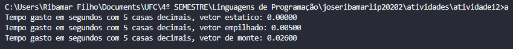

# Atividade 12 de Linguagens de Programação 2020.2

## Aluno: José Ribamar Silva Soares Filho
## Matrícula: 472687

### Questão 01

Responda ou forneça as definições em cada item:

1. O que é lado esquerdo de uma variável? O que é o lado direito?

    + O lado esquerdo da variável é conhecido como o endereço da variável, poís é o endereço que sera usado quando uma variável aparece do lado esquerdo da atribuição.
    + O lado direito por sua vez é conhecido como o valor da variável, poís se encontra do outro lado da atribuição.

2. Após o projeto e implementação de uma linguagem, quais são os quatro tipos de vinculações que podem ocorrer em um programa?

    - Tempo de compilação;
    - Tempo de projeto de compilador;
    - Tempo de execução;
    - Tempo de ligação.

3. Defina vinculação estática e vinculação dinâmica.

    - Vinculação Estática: Ocorre quando antes do tempo de execução do programa e permanece inalterada por toda sua execução.
    - Vinculação Dinâmica: Ocorre na vinculação durante a execução do programa ou quando pode ser mudada durante a execução.

4. Defina variáveis estáticas, dinâmicas na pilha, dinâmicas no monte explícitas e dinâmicas do monte implícitas. Apresente exemplos em linguagens de programação, com trechos de código.

    - Variáveis estáticas: São vinculadas a células de memória antes do programa executar e pemanecem no mesmo endereço durante toda a execução do mesmo. Geralmente são acessáveis globalmente é possuem uma maior eficiência comparada a variáveis criadas em tempo de execução.
        ```
        // Exemplo em C
        #include <stdio.h>

        static int arrayLength = 100; // Variável foi declarada num escopo global e não permite sua alteração por ser static.
        int main() {
            int array[arrayLength];
            ...
            return 0;
        }
        ```
    - Variáveis dinâmicas na pilha: Estas são criadas quando um programa atinge um marco de execução, este marco pode ser um bloco ou execução de uma função por exemplo, e só existem durante o curso de vida da marco.
        ```
        // Exemplo em C
        void multiplicarPorDois(int n) {
            int multiplo = n * 2; // A variável é alocada e fica empilhada até terminar a execução da função, ao terminar, a variável é liberada.
            return multiplo;
        }
        int main() {
            int n = 4;
            printf("%d\n", multiplicarPorDois(n));
            return 0;
        }
        ```
    - Variáveis de monte explícitas: Essas são alocadas e liberadas em pontos explicitos durante a execução do programa, um exemplo são os ponteiros em C, que são alocados com a função malloc ou calloc e ao final de seu uso devem ser descartados com a função free.
        ```
        //Exemplo em C
        #include <stdio.h>
        #include <stdlib.h>

        int main() {
            int *n;
            n = (int *) malloc(sizeof(int)); // Variável é alocada e referenciada a um ponto da memória.
            ... Execução do programa
            free(n); // Quando o programa acabar ou o uso da variável é terminado, ela pode ser liberada manualmente com o uso da função free(*);
            return 0;
        }
        ```
    - Variáveis de monte implícitas: São alocadas e liberadas quando há alguma atribuição a elas, são flexiveis em seu tipo, porem há perda de eficiência já que é necessário sempre saber qual o tipo da variável atualmente.
        ```
        // Exemplo em Python

        lista = ["Pão", "Hamburguer", "Queijo", "Tomate", "Picles", "Alface", "Molho"] 
        // Lista recebe um array
        typeof(lista) 
        // Retorna que é uma 'list'

        lista = 7 // Lista recebe um number
        typeof(lista) // Retorna que é um 'int'

        lista = "Pão, Hamburguer, Queijo, Tomate, Picles, Alface e Molho Especial" // Lista recebe uma String
        typeof(lista) // Retorna que é um 'str'

        // A flexibilidade permite que a mesma variável seja usada para varios usos, porém é sempre necessário saber qual o tipo atual dela, o que causa lentidão no sistema.
        ```

### Questão 02

Escreva três funções em C ou C++: uma que declare um grande vetor inteiro de 10000 posições estaticamente, outra que declare o mesmo grande vetor na pilha e outra que crie o mesmo grande vetor no monte. Chame cada um desses subprogramas 100 mil vezes e mostre na tela o tempo gasto em cada tipo de função. Explique os resultados. Em um ambiente Linux com o compilador gcc, use a função clock do cabeçalho time.h para medir o tempo. Veja o exemplo abaixo:
```
 clock_t begin = clock();
 
 /* Trecho de código a ser analisado. */
 
 clock_t end = clock();
 
 double time_spent = (double)(end - begin) / CLOCKS_PER_SEC;
 printf("Tempo gasto em segundos com 5 casas decimais: %.5f\n", time_spent);
```

Código: questao02.c

Execução: 

O vetor estático é criado antes da propria execução do programa, logo ele não gastará tempo em sua execução ou um tempo minimo. No vetor de pilha, ele só existe na pilha e logo após é descartado, o que faz que ele só gaste a memória enquanto é utilizado. O vetor de monte é o que mais gasta tempo em sua criação, poís em sua criação sempre é necessário alocar um espaço de memória em sua criação e ao final de seu uso, gasta o tempo de liberar o mesmo espaço de memória.
