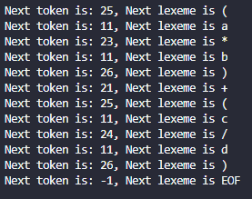

# Exercício 06 de Linguagens de Programação 2020.2

## Aluno: José Ribamar Silva Soares Filho
## Matrícula: 472687

### Questão 01

Considere a representação dos números reais como duas partes inteiras separadas por ".". Por exemplo: 32.471 e 5.327. Seja um alfabeto o conjunto dos dígitos ({0, 1, 2, 3, 4, 5, 6, 7, 8, 9} ou [0-9]) unido ao caractere ".". Em cima desse alfabeto, forneça:

1. Uma expressão regular que represente os números reais na notação apresentada.

    [0-9]+ .? [0-9]*

2. Um diagrama de estados que indique a aceitação ou não de um número real na notação apresentada.

    

### Questão 02

Utilizando o código disponível no .pdf do livro texto, páginas 195-199, coloque-o em um arquivo e faça a compilação do executável. Em seguida, forneça a seguinte entrada:

```
(a * b) + (c / d)
```

Coloque a saída como resposta desta questão.

